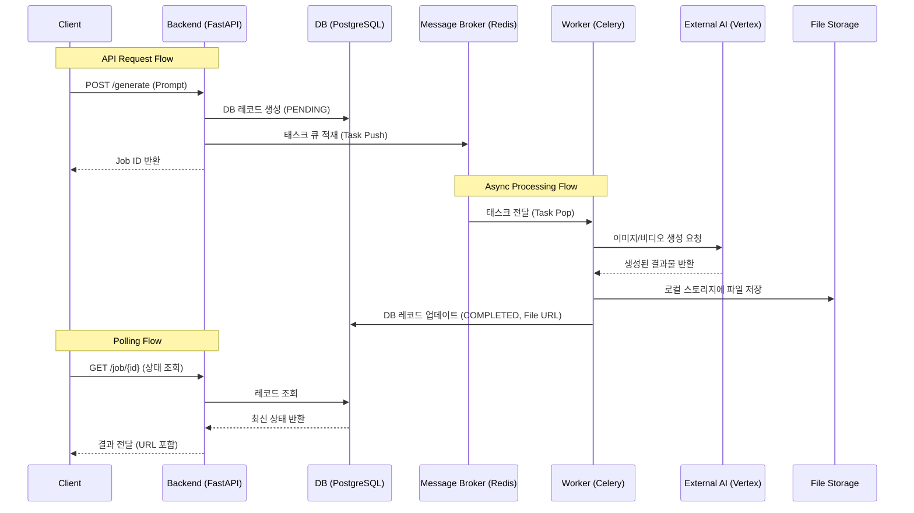

# [KRAFTON 채용 과제] AI 멀티모달 콘텐츠 생성 플랫폼 구축

본 프로젝트는 KRAFTON의 과제 결과물로써, Google Vertex AI 의 멀티모달 생성 AI 모델(Imagen, Veo)을 활용해 게임 에셋을 생성하고 관리하는 통합 플랫폼입니다.

## Key Features
### 의미 기반 검색 (Semantic Search)
 단순 키워드 매칭이 아닌, `pgvector`를 활용한 벡터 유사도 검색

### 프롬프트 입력 실시간 감지하여 기생성된 결과물 추천 기능
프롬프트의 내용을 파악하여 유사도가 가장 비슷한 결과물을 순서대로 미리 추천

### 한국어 특화 임베딩
한국어 문맥 이해도가 높은 `KURE-v1` 모델을 사용하여, 복잡하고 추상적인 묘사("울퉁불퉁한 질감" 등)도 정확하게 검색
### 작업 큐 분리 
IO-Bound(영상 생성) 작업과 CPU-Bound(임베딩 생성) 작업을 서로 다른 Celery Queue로 분리
### 실시간 상태 동기화
Redis Pub/Sub과 Server-Sent Events (SSE)를 결합하여, 생성 작업의 진행 상태를 사용자에게 실시간으로 전달
### Modern Web App
Next.js (App Router)와 TypeScript 기반의 반응형 웹 애플리케이션
### 몰입형 갤러리 
Masonry 레이아웃을 적용하여 다양한 비율의 생성 결과물을 직관적으로 탐색할 수 있으며, 상세 보기 오버레이를 지원
### 효율적인 상태 관리
TanStack Query를 도입하여 데이터 캐싱 및 백그라운드 동기화를 최적화
### 레이어드 아키텍처 
확장성을 고려하여 Controller, Service, Domain, Infrastructure 계층을 명확히 분리
### 완전한 컨테이너화 
Docker & Docker Compose로 프론트엔드, 백엔드, DB, Redis, Worker 등 전체 환경을 한 번에 구성
### 개발 편의성 
VS Code Dev Containers 지원 및 Makefile을 통한 통합 명령어(빌드, 실행, 테스트 등)를 제공


## 주요 기술 스택

### Frontend
- **Framework**: [Next.js 15 (App Router)](https://nextjs.org/), React 19
- **Language**: TypeScript
- **Styling**: Tailwind CSS v4, Motion (Framer Motion)
- **State Management**: TanStack Query v5 (Server State), Zustand (Client State)
- **Component**: Headless UI, Masonry Layout (masonic)
- **Test**: Vitest, React Testing Library

### Backend
- **Framework:** [FastAPI](https://fastapi.tiangolo.com/) (Python 3.11+)
- **Database**: PostgreSQL 16 (w/ pgvector), SQLAlchemy (ORM), Alembic (Migration)
- **Task Queue:** Celery + Redis (비동기 처리)
- **AI Integration:** Google Vertex AI


### Infrastructure & DevOps
- **Infrastructure:** Docker & Docker Compose
- **Dev Environment:** VS Code Dev Containers
- **Package Manager**: npm (Frontend), pip (Backend)
- **Build Tool**: Makefile

## 구동 가이드 (Getting Started)

### 1. 환경 준비
- `docker`와 `docker-compose`가 설치되어 있어야 합니다.
- `.env` 파일을 생성하고 필요한 설정값을 입력합니다.

### 2. 컨테이너 실행
```bash
# 원스톱 실행
$docker-compose up -d
```
### 3. **마이그레이션 적용:**

   ```bash
   #docker-compose에 자동으로 되어 있습니다. 
   $alembic upgrade head
   ```

### 3. API 문서 확인
서버 실행 후 아래 주소에서 Swagger 문서를 확인할 수 있습니다.
- [http://localhost:8000/docs](http://localhost:8000/docs)

### 4. 주요 관리 명령 (Makefile 참조)
> frontend, backend 동시 진행
- `make test-setup`: 테스트 환경 구성 (최초 1회 필수)
- `make test`: 전체 테스트 실행
- `make test-cov`: 테스트 커버리지 리포트 생성 (`htmlcov/`)
- `make test-down`: 테스트 환경 종료


## 폴더 구조 (Folder Structure)
```text
├── backend/
│   ├── app/
│   │   ├── api/            # API Endpoints (Asset, Health)
│   │   ├── core/           # Configuration & Settings
│   │   ├── domain/         # Domain Models & Interfaces (DDD)
│   │   ├── infrastructure/ # Implementation (DB, Vertex AI)
│   │   ├── schemas/        # Pydantic Data Schemas
│   │   ├── services/       # Business Logic Layer
│   │   ├── worker/         # Celery Task Definitions
│   │   └── main.py         # Backend Entry Point
│   ├── alembic/            # Database Migrations
│   ├── tests/              # Test Suite (Unit, Integration)
│   ├── Dockerfile          # Backend Image Build
│   └── Makefile            # Backend Commands
├── frontend/
│   ├── src/
│   │   ├── app/            # Next.js App Router Pages
│   │   ├── components/     # UI Components (Gallery, Generation)
│   │   ├── hooks/          # Custom React Hooks
│   │   ├── lib/            # Utilities & Helper Functions
│   │   ├── services/       # API Client Services
│   │   ├── stores/         # Global State Management
│   │   └── types/          # TypeScript Type Definitions
│   ├── public/             # Static Assets
│   ├── Dockerfile          # Frontend Image Build
│   ├── next.config.ts      # Next.js Configuration
│   └── vitest.config.ts    # Test Configuration
├── docker-compose.yml      # Service Orchestration
└── Makefile                # Project Management Commands
```

## 📊 ERD (Entity Relationship Diagram)


| 필드 | 타입 | 설명 |
|------|------|------|
| `id` | INTEGER | Primary Key |
| `job_id` | VARCHAR | 비동기 작업 추적용 고유 ID (UUID) |
| `status` | ENUM | 작업 상태 (Pending, Processing, Completed, Failed) |
| `asset_type` | ENUM | 에셋 타입 (Image, Video) |
| `prompt` | TEXT | 사용자 입력 프롬프트 |
| `model` | VARCHAR | 사용된 AI 모델 (Imagen, Veo 등) |
| `file_path` | VARCHAR | 생성된 파일의 저장 경로 |
| `embedding_kure` | VECTOR(1024) | 검색을 위한 고차원 벡터 임베딩 (1024차원) |
| `search_document` | TEXT | 검색 정확도 향상을 위한 상세 설명 텍스트 |
| `width` / `height` | INTEGER | 이미지 해상도 정보 |
| `error_message` | TEXT | 생성 실패 시 상세 에러 로그 |
| `created_at` | TIMESTAMP | 레코드 생성 시간 |
| `updated_at` | TIMESTAMP | 상태 변경 시간 |

## 백엔드 & 워커 아키텍처

사용자 요청 처리와 비동기 백그라운드 작업의 데이터 흐름은 다음과 같습니다.



