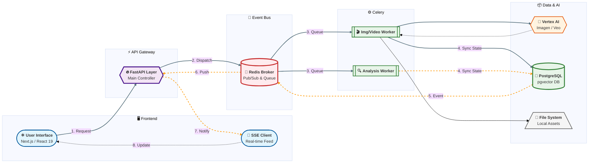

> ### Q1. 본인이 구현한 프론트엔드, 백엔드, DB 아키텍처를 그림(다이어그램)으로 표현하고, 특정 라이브러리나 아키텍쳐를 왜 선택했는지 설명해 주세요.

#### 1. Celery Queue 분리
*비디오 생성(`Vertex AI` 호출)* 은 시간은 오래 걸리지만 CPU를 거의 쓰지 않는 IO-Bound 작업입니다. 반면에 *검색용 임베딩 생성(`KURE-v1`)* 작업은 소요 시간은 짧지만 CPU를 많이 사용하는 CPU-Bound 작업입니다. 이 작업을 모두 FastAPI에서 처리하면 분석 작업 하나 때문에 전체 서버가 멈출 수 있습니다. 따라서 Celery Queue를 사용하여 사용자의 생성요청 처리가 내부적 분석 때문에 지연되는 상황을 예방했습니다. 가벼운 Redis Queue도 선택지 중에 하나였지만, 네트워크 문제나 네트워크 장애가 빈번하게 발생할 수 있는 외부 API를 이용한다는 점을 고려하여 Backoff 구현이 손쉬운 Celery를 선택했습니다.

#### 2. Redis Pub/Sub + Server-Sent Events (SSE)
메시지 브로커에는 여러가지가 있지만, 저는 프로젝트의 요구사항에 따라 작업 결과를 저장하고 실시간 알림을 프론트엔드로 보내는 기능에 집중했습니다. 또한, 프로젝트의 규모가 작으므로 운영복잡도를 늘리지 않고자 했습니다. RabbitMQ나 Kafka를 사용하면, 작업 결과를 저장할 별도의 DB가 필요하고, 실시간 알림을 위해 또 다른 소켓 서버가 필요합니다. 따라서 운영복잡도가 높습니다. 하지만 Redis는 메모리 기반이라 가장 빠르면서도 저장, 알림을 하나만으로 해결할 수 있다고 판단했습니다.

#### 3. 데이터베이스: PostgreSQL + pgvector (w/ KURE-v1)
단순 텍스트 매칭이 아닌, 벡터 임베딩(Vector Embedding) 기반의 의미 검색(RAG)을 구현하기 위해 PostgreSQL에 pgvector 확장을 적용했습니다. 별도의 벡터 DB(Pinecone 등)를 쓰지 않고 RDB인 Postgres에 pgvector를 붙인 이유는, 메타데이터(작성자, 날짜) 필터링과 벡터 유사도 검색을 한 번의 쿼리로 `Join`없이 처리하여 복잡도와 지연 시간을 줄이고자 했습니다. KURE-v1는 한국어 문맥 이해도를 극대화한 SOTA급 모델입니다. 일반적인 다국어 모델은 "사과"는 잘 찾지만, "울퉁불퉁한" 같은 형용사적 뉘앙스나 질감을 벡터 공간에 정교하게 배치하는 데 한계가 있습니다. 일반 문장보다 길고 묘사가 구체적일 게임 에셋 생성 프롬프트에 적합하다고 판단했습니다. 또한 OpenAI의 `text-embedding-3-large` 같은 모델은 매번 호출 비용이 발생하고 속도가 네트워크 환경에 의존합니다. `KURE-v1`은 Docker에서 직접 돌릴 수 있어 API 비용이 들지 않고, ONNX 양자화를 적용하면 CPU 환경에서도 매우 빠른 검색이 가능합니다.

---
> ### Q2. AI 어시스턴트가 생성한 코드를 실제 프로젝트에 반영할 때, 엔지니어로서 가장 중요하게 검증해야 하는 항목은 무엇이라고 생각하며 그 이유는 무엇인가요?

AI는 학습된 패턴에 따라 행동합니다. 그래서 무엇을 학습했는지가 중요합니다. 학습한 내용이 신뢰도가 높은지, 혹은 학습 데이터가 최신인지 등의 여부에 따라 AI의 판단이 달라집니다. 또한, 프로젝트에 대한 충분한 컨텍스트가 주어지지 않고, 개발자의 코드에 대한 이해가 선행되지 않으면 AI가 생성한 코드는 단편적인 해결에 그치며 장기적으로는 복잡하고 이유없이 거대한 코드가 되고맙니다. 따라서 엔지니어는 AI가 생성한 코드라 할지라도 스스로 이해하지 못하는 기술이나 코드를 적용하는 것은 지양해야 안됩니다. AI는 완벽하지 않으므로, 엔지니어는 리서치와 학습을 해서 AI가 작성한 코드를 리뷰할 수 있어야 합니다. AI의 학습 속도는 빠르고, 인간은 비교적 느리더라도 코드의 주인이 되기 위해서 반드시 지켜야 하는 원칙이라고 생각합니다.

---
> ### Q3. 과제 수행 중 AI 의 한계(로직 오류, 설계 결함 등)를 경험했다면, 왜 그런 문제가 발생했다고 판단했는지와 본인의 지시나 수정을 통해 이를 어떻게 해결했는지 구체적으로 기술해 주세요.

Text-to-Video 기능을 구현하는 과정에서 API 호출 호환성 문제를 겪었습니다. Video를 생성하는 API를 호출하여 OperationName을 정상적으로 반환받았고, 이 값을 이용해서 완료 여부를 조회하여 Polling을 구현할 계획이었습니다. API 명세는 웹에 공개되어있으므로, AI 어시스턴트가 해당 API 주소를 잘 찾아와서 입력해줄 것이라고 기대했습니다. 하지만 계속해서 404, 400 에러 등이 발생했습니다. 이는 AI가 모델별로 상이한 API 스펙을 알지 못했고, 웹의 최신 데이터를 컨텍스트로 삼지 못했기 때문이었습니다. 결국 직접 API 명세를 찾아서 적용하니 해결되었습니다.

